# Aula01 - Introdução ao Python

## Python

Python é uma linguagem de programação interpretada, orientada a objetos, de alto nível e com semântica dinâmica. A simplicidade do python reduz a manutenção de um programa.
A linguagem suporta módulos e pacotes, que encoraja a modularização e o reuso de códigos.

É uma das linguagens  que mais tem crescido devido a sua compatibilidade e capacidade de auxiliar outras linguagens, é também um das  linguagens mais populares entre a comundade de análise de dados e a comunidade cientifica.

## História do Python

A linguagem Python foi criada em 1990 por Guido Van Rossum no Centro de Matemática Stichting (CWI - http://www.cwi.nl) na Holanda como sucessora da linguagem ABC. Guido é lembrado como o principal autor do Python, mas outros programadores ajudaram com muitas contribuições.

A linguagem ABC foi desenhada para o uso de não programadores, mas logo de início mostrou certas limitações e restrições, a grande reclamação era a presença de regras arbitrárias que geralmente eram utilizadas em linguagens de baixo nível.

O Python surigiu para que fosse uma linguagem simples que possuísse algumas das melhores propriedades da linguagem ABC. Listas, dicionários, declarações básicas e uso obrigatório de identação diferenciam a linguagem Python da linguagem ABC.

Em 1995, Guido continuou seu trabalho em Python na Corporation for National Research Initiatives (CNRI, http://cnri.reston.va.us). Em 2000 o time de desenvolvimento da linguagem foram para a BeOpen Python Labs (http://beopen.com), no mesmo ano mudaram-se para a Digital Creations, hoje Zope Corporation (http://www.zope.org).

Em 2001 foi fundada a Python Software Fundation (PSF - http://www.python.org/psf/), uma organização sem fins lucrativos fundada para manter a lingaugem e hoje detem sua propriedade intelectual.

Todos os lançamentos de novos releases da linguagem Python são de código aberto.

## Interpretador

Você já deve ter ouvido falar que a linguagem Python é interpretada ou uma linguagem de script. em certo sentido pode-se afirmar que é uma linguagem interpretada, mas na verdade a forma de execução de programas python atualmente assemelha-se a forma de execução da linguagem Java.

O interpretador faz a tradução em tempo real para código de máquina, ou seja, em tempo de execução. Já um compilador traduz o programa inteiro em código de máquina em uma única vez, gerando um relatório de erros caso existam ou gerando o programa que pode ser rodado (executável).

O  Python é uma linguagem interpretada mas como o Java, passa por um processo de compilação gerando um bytecode e depois é interpretado por uma máquina virtual.

## É possível compilar o Python ?

Existem implementações de compiladores para Python como o Cpython, Cython, Jython, IronPython ou PyPy. A diferença entre elas é o compilador.

o Cpython é o compilador oficial da linguagem Python quando você a utiliza por padrão. O Cython converte a linguagem Python para C++e utiliza o compilador desta linguagem para gerar o executável, mas para ser eficiente deve adaptar o código python original.

O Jython gera bytecode a partir do Python para ser executado na JVM (Java Virtual Machine) e o IronPython em uma máquina virtual .Net.

O PyPy é uma implmentação escrita em python que possui uma Virtual Machine Python sendo mais veloz que o CPython origianl e vem com a tecnologia JIT (Just in Time) que já traduz o código fonte em linguagem de máquina.

## Modo Script ou Interativo

Para utilizar o modo interativo você deve abrir o terminal do seu sistema operacional e rodar o python. Por exemplo:

**C:\python**

Você terá acesso ao prompt do Python para a digitação de suas instruções:

No modo script você pode utilizar qualquer editor de texto para escrever o seu código python gerando um arquivo com a extensão .py. Pode utilizar qualquer IDE que desejar como o PyCharm, VSCode, Spyder entre outras existentes no mercado.

## Variáveis

Variáveis são pequenos espaços de memória, tuilizados para armazenar e manipular dados. Em Python, os tipos de dados básicos são: o tipo inteiro (armazena números inteiros), o tipo float (armazena números em formato decimal), tipo string (armazena um conjunto de caracteres) e o tipo booleano ( que armazena verdadeiro ou falso). Cada variável pode armazenar apenas 1 tipo de dado a cada instante.

Em Python diferentemente de outras lingaugeens de programação que você está acostumado a utilizar como o Java ou C/C++ não é preciso declarar de que tipo será cada variável no programa. Quando se faz uma atribuição de valor, automaticamente a variável se torna do tipo do valor armazenado, como nos exemplos a seguir:

**>> a=10 - valor inteiro**

**>> nome = "Joaquim" - string**

**>>ok=True - valor booleano**

**>>salario=10500.52 - valor decimal (float)**

Em Python os nomes das variáveis devem ser iniciados com uma letra, mas podem possuir outros tipos de caracteres, como números e símbolos. O símbolo sublinhado ( _ ) também é aceito no ínico de nomes de variáveis, exemplos de nomes válidos e invalidos:

**Válidos:**
a3, velocidade, velocidade90, salario_medio, _salario

**Invalidos**
salário_médio, salario medio, 5A,

Nossos nomes de variáveis não podem ter espaços em branco e devemos evitar o uso de acentos.

## Entrada de dados

O python possui uma função de captura para as entradas do usuário: a função input(). Quando essa função é chamada, o programa espera o usuário digitar alguma coisa. Quando o usuário aperta a tecla ENTER, o programa processa e imprime na tela o valor digitado em forma de String.

Deste modo as entradas de dados serão sempre no formato String, como no exemplo abaixo a variavel salario e a variavel nome serão do tipo String.

**salario = input("Entre com o seu salario: ")**

**nome = input("Entre com o seu nome: ")**

## Conversão de Tipos de Dados

A função  input() lê o valor digitado pelo usuário como uma string.

**salario = input("Entre com o seu salario: ")**

Se o usuário digitar o número 1400 a variável salario armazenará a string "1400", podemos checar isso com a função type():

**type(salario)**
retorno: 
**class 'str'**

Para conseguirmos receber um valor inteiro ou decimal devemos utilizar funções de conversão: **int()**, **float()** ou **complex()** se por acaso utilizarmos números complexos.
Podemos também fazer a conversão de númericos para string com a função **str()**.

**salario = float(input("Entre com o seu salario: "))**

No exemplo acima a função input() receberá um valor String que será convertido para o tipo float pela função float() e armazenado na variavel salario.

## Saída de Dados

Para a saída de dados o Python possui a função print(). Por exemplo podemos exibir o valor digitado anteriormente na variável salario da seguinte forma:

**print("O salario informado foi: " + salario)**

Neste exemplo concatenamos a string com a variável salario (de tipo string) com o operador +. Outra maneira mais elegante é usar a função format():

**print("O sálario informado foi de {} reais".format(salario))**

Se tentarmos concatenar a saida na função print() com uma variavel numérica ocasionará um erro de execução.

**print("O valor da venda foi "+valor_venda)**

Podemos corrigir esse problema utilizando a função **format()**. Está função faz parte de um conjunto de formatação de Strings chamada formatter, que é composto por outras funções de formatação mas a função format é a principal e mais utilizada.

Com ela podemos passar parâmetro de qualquer itpo, além de ser extremamente útil para formatar números passando o seu format code. Por exemplos, podemos arredondar um número ponto flutuante como 300.565656789 para duas casas decimais ou fazer a saída do valor da venda corretamente.

**print("O valor da venda foi {:.2f}".format(valor_venda))**

**numero_pto_flutuante = 300.565656789** 

**print("numero ponto flutuante : {:.2f}".format(numero_pto_flutuante))**

## Manipulação de Strings

Em Python existem várias funções para manipular Strings. Na tabela abaixo são apresentados os principais métodos.

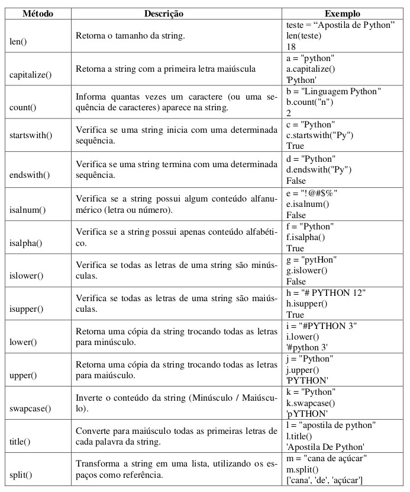
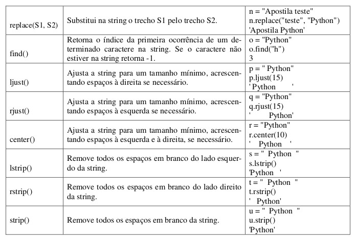

### Fatiamento de Strings

O fatiamento de strings é uma ferramenta usada para extrair apenas uma parte dos elementos de uma string.

**Nome_String[limie_inferior : Limite_superior]**

Retorna uma string com os elementos das posições do limite_inferior até o limite_superior.

Exemplo:

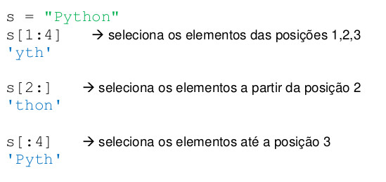

## Listas

Lista é um conjunto sequencial de valores, onde cada valor é identificado através de um índice. O primeiro valor tem índice 0. Uma lista em Python é declarada da seguinte forma:

**Nome_Lista = [ valor1, valor2, ..., valorN]**

Uma lista pode ter valores de qualquer tipo, incluindo outras listas.

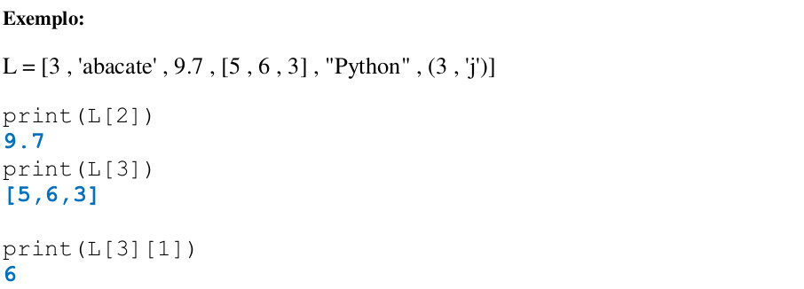

Para alterar um elemento da lista, basta fazer uma atribuição de valor através do índice. O valor existente será substituído pelo novo valor.

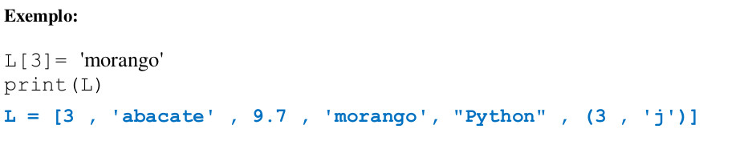

A tentativa de acesso a um índice inexistente resultará em erro.

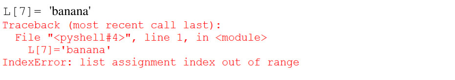

### Funções para manipulação de listas

A lista é uma estrutura mutável, ou seja, ela pode ser modificada. Na tabela a seguir estão algumas funções utilizadas para manipular listas.

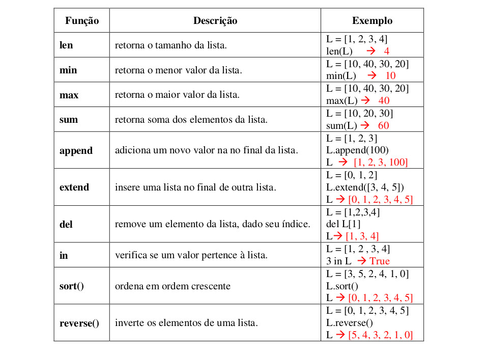

### Operações com listas

**Concatenação (+)**

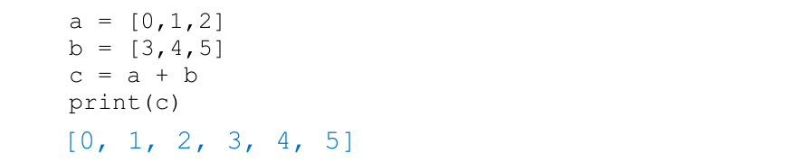

**Repetição (*)**

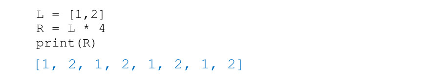

### Fatiamento de Listas

O fatiamento de listas é semelhante ao fatiamento de strings.

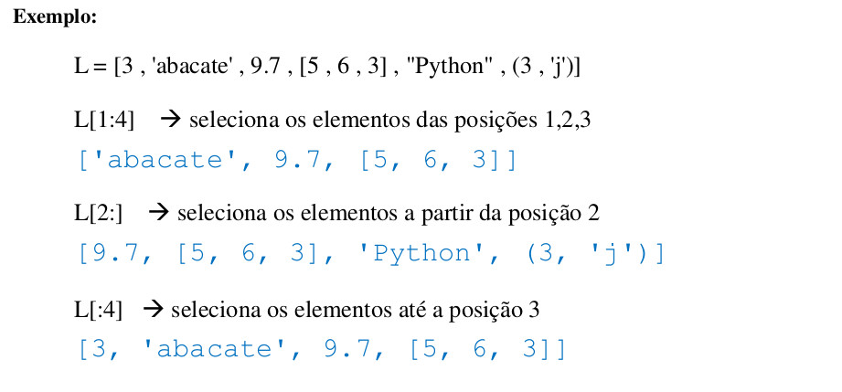

### Criação de listas com range()

A função range() define um intervalo de valores inteiros. Associada a list(), cria uma lista com os valores do intervalo.

A função range() pode ter de 1 a 3 parâmetros:

* range(n) - gera um intervalo de 0 a n-1
* range(i , n) - gera um intervalo de i a n-1
* range(i , n, p) - gera um intervalo de i a n-1 com intervalo p entre os números

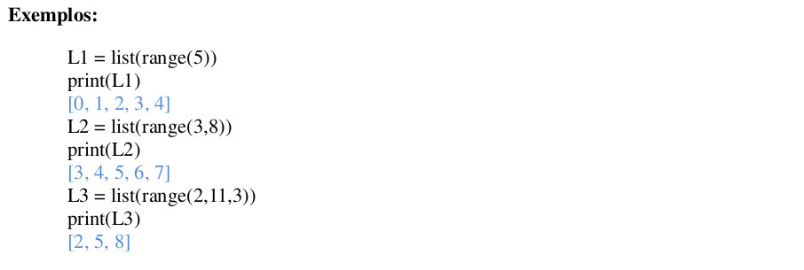

## Operadores Aritméticos

## Operadores de Comparação

## Operadores Lógicos

## Estrutura de Decisão

As estruturas de decisão permitem alterar o curso dofluxo de execução de um programa, de acordo com o valor (veradeiro/falso) de um teste lógico.

Em Python temos:

**if (se)**

**if..else (se .. senão)**

**if .. elif .. else (se .. senão se .. senão)**

### Estrutra if

O comando **if** é utilizado quando precisamos decidir se um trecho do programa deve ou não ser executado. Ele é associado a uma condição, e o trecho de código será executado se o valor da condição for verdadeiro.

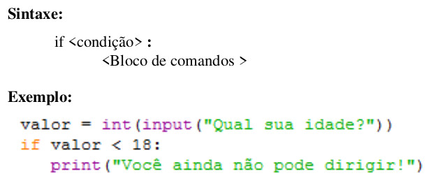

### Estrutra if..else

Na estrutura **if .. else** um trecho de código será executado se a condição for verdadeira e o outro se a condição for falsa.

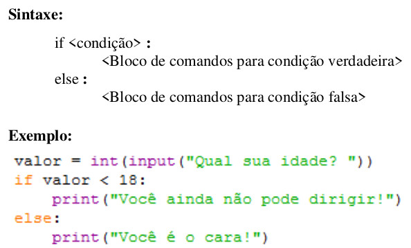

### Estrutra if..elif..else

Se houver diversas condições, cada uma associada a um trecho de código, utiliza-se o **if .. elif .. else**.

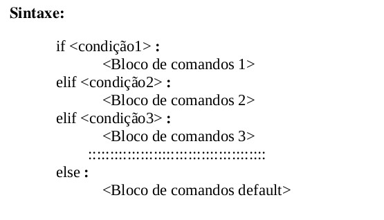

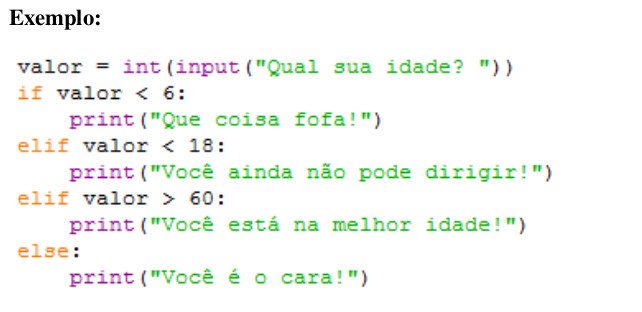

## Estruturas de Repetição

A Estrutura de repetição é utilizada para executar uma mesma sequência de comandos várias vezes. A repetição está associada ou a uma condição, que indica se deve continuar ou não a repetição, ou a uma sequência de valores, que determina quantas vezes a sequência deve ser repetida. As estruturas de repetição são conhecidas também como laços (loops).

### Laço While (Pré-condição)

No laço while, o trecho de código da repetição está associado a uma condição. Enquanto a condição tiver valor verdadeiro, o trecho é executado. Quando a condição passa a ter valor falso, a repetição termina.

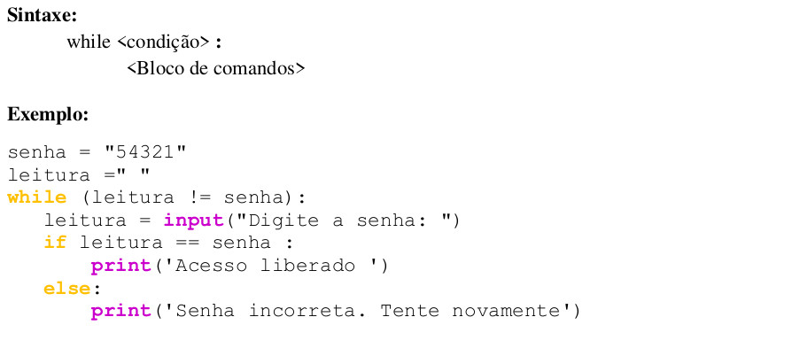

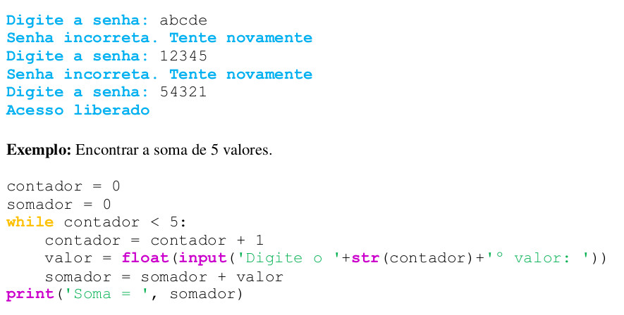

### Laço For (contador)

O laço for é a estrutura de repetição mais utilizada em Python. Pode ser utilizado com uma sequência numérica (gerada com o comando range) ou associado a uma lista. O trecho de código da repetição é executado para cada valor da sequência numérica ou da lista.

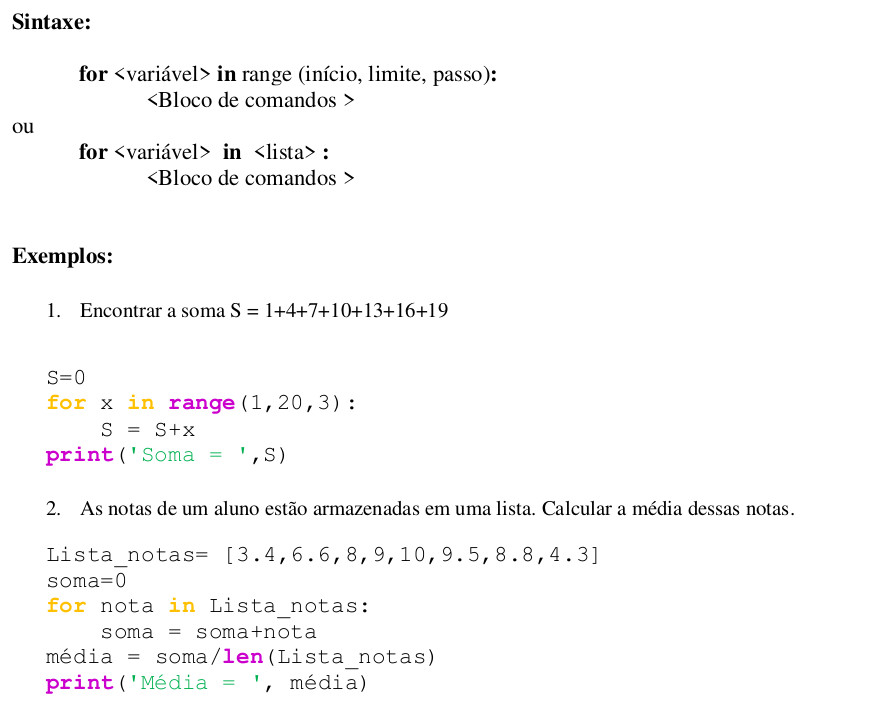

## Funções

Funções são pequenos trechos de código reutilizáveis. Elas permitem dar um nome a um bloco de comandos e executar esse bloco, a partir de qualquer lugar do programa.

### Como definir uma função

Funções são definidas usando a palavra-chave **def**, conforme sintaxe a seguir:

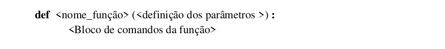

Obs.: A definição dos parâmetros é opcional.

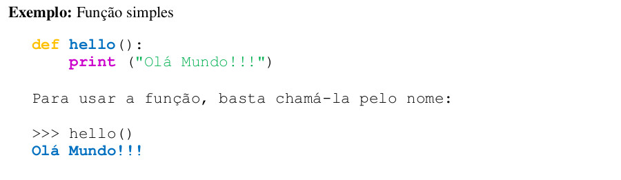

### Parâmetros e argumentos

Parâmetros são as variáveis que podem ser incluídas nos parênteses das funções. Quando a função é chamada são passados valores para essas variáveis. Esses valores são chamados argumentos. O corpo da função pode utilizar essas variáveis, cujos valores podem modificar o
comportamento da função.

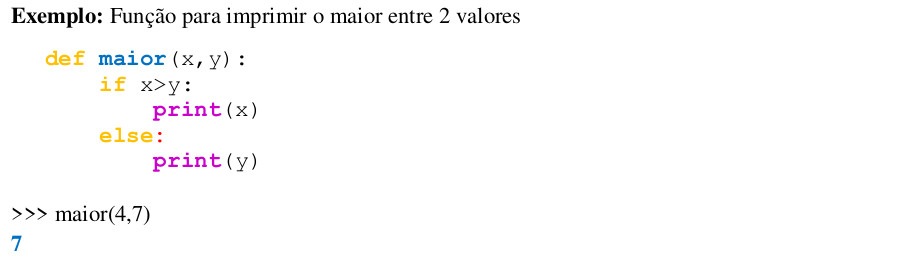

### Escopo das variáveis

Toda variável utilizada dentro de uma função tem escopo local, isto é, ela não será acessível por outras funções ou pelo programa principal. Se houver variável com o mesmo nome fora da função, será uma outra variável, completamente independentes entre si.

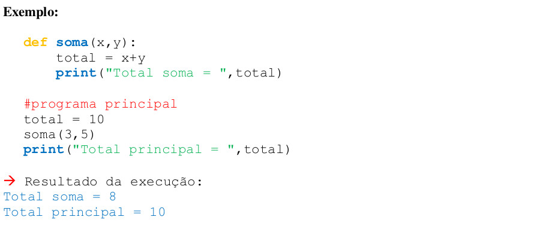

Para uma variável ser compartilhada entre diversas funções e o programa principal, ela deve ser definida como variável global. Para isto, utiliza-se a instrução global para declarar a variável em todas as funções para as quais ela deva estar acessível. O mesmo vale para o programa principal. 

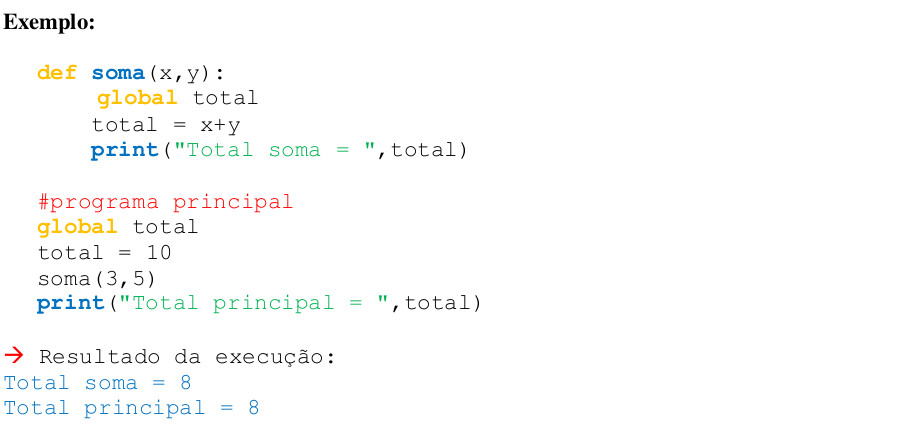

### Retorno de valores

O comando return é usado para retornar um valor de uma função e encerrá-la. Caso não seja declarado um valor de retorno, a função retorna o valor **None** (que significa nada, sem valor).

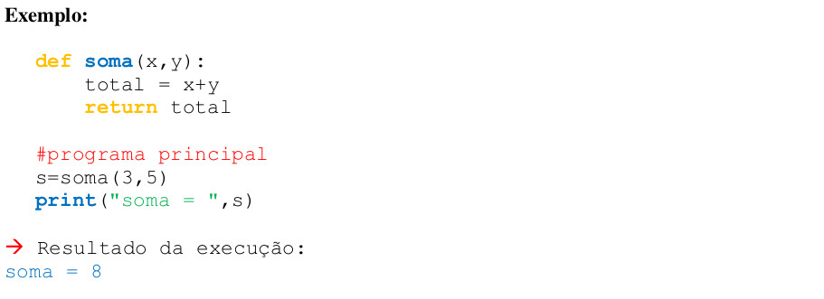

Observações:

a. O valor da variável total, calculado na função soma, retornou da função e foi atribuído à variável s.

b. O comando após o return foi ignorado.

### Valor Padrão

É possível definir um valor padrão para os parâmetros da função. Neste caso, quando o valor é omitido na chamada da função, a variável assume o valor padrão.

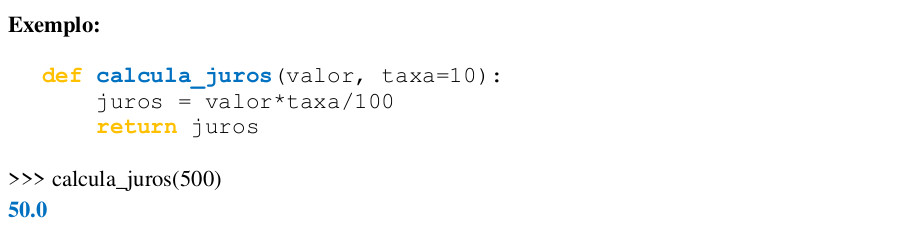

