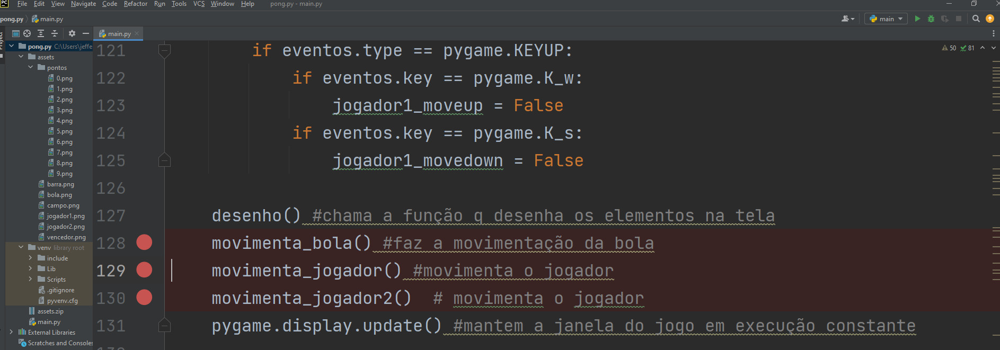

# Curso PyGame

## Introdução ao Pygame - Jogo Pong

Crie um projeto na sua IDE PyCharm chamado Pong.

No arquivo main.py vamos importar nossa biblioteca PyGame para conseguir desenvolver nosso primeiro jogo.

Digite o Import pygame e você perceberá que o pygame ficou grifado em vermelho pois não temos a biblioteca instalada em nosso ambiente de desenvolvimento.

Para instalarmos o PyGame clique sobre o import pygame e vcocê perceberá que irá aparecer uma lampada (dica) na cor vermelha. Clique sobre a dica e escolha a opção "Install Package PyGame" e a IDE irá instala-la em seu ambiente virtual.

Uma vez instalado o Pygame podemos iniciar a configuração de janela de nosso game. Digite o código como abaixo:

Na linha 4 temos a inicialização da biblioteca do pygame. Na linha 6 definimos o tamanho da janela de execução de nosso game e na linha 8 definimos o texto da barra de titulo desta janela.

Se você mandar executar o projeto neste momento vai perceber que a janela irá apenas piscar na sua tela, ou seja a janela é executada e logo em seguida a execução é encerrada.

Para resolvermos esse problema temos que criar um laço com um loop de condição infinita. Todo jogo possui um laço deste modo "While True".

Na próxima imagem vamos definir uma variavel executa valendo True que será passada para o nosso laço While mantendo a janela do jogo em execução permanente.

Na linha 12 criamos a variável executa= True e passamos ela como condição do laço While. Assim nosso jogo ficará com a janela sendo atualizada de forma permanente pela linha de código 19.

Para encerrarmos a execução devemos alterar o valor da variável executa para False terminando nosso laço. 

Para isso o usuário deverá clicar no botão "X" de nossa janela e dentro de nosso programa esse clique constitui um evento que deve-se captura e tratado em nosso código.

Na linha 14 é montado um laço for que percorre uma lista de eventos gerado pelo comando pygame.event.get() que consegue capturar o pressionamento de teclas ou cliques do mouse para podermos tratr-los de maneira adequada ao jogo.

Assim na linha 16 vamos verificar no IF se temos um evento do tipo QUIT e se sim alteramos o conteudo da variável executa para False encerrando nosso game.

## Colocando Imagem de Fundo em nosso Jogo

Observe na próxima imagem as linhas grifadas em azul. 
Na linha 10 importamos a imagem de fundo de nosso jogo utilizando o pygame.image.load.
Essa imagem pode ser obtida junto com um aquivo zip com recursos necessários ao nosso projeto junto com esse tutorial.

Baixe o arquivo zip e descompacte a pasta "assets" que está compactada neste arquivo dentro da pasta do seu projeto do Pycharm para que o projeto possa ter acesso as imagens que utilizaremos.

Geralmente a pasta PyCharm Projects está em C:\Usuarios \ "nome do usuario" \ ...

Na linha 12 posicionamos a imagem pelo seu canto superior direito na posição superior direito da janela de nosso jogo.

Após inserida a imagem corretamente executamos nosso projeto para verificarmos o resultado.

## Inserindo Jogadores e a bola ao Game

Vamos agora posicionar a imagem dos jogadores 1 e 2 em frente as suas metas (linhas de defesa) e a bola centralizada no centro de nosso campo de jogo.

Nas linhas14 e 16 temos o código de importação da imagem de cada um dos jogadores e nas linhas 15 e 17 podemos observar os códigos que posicionam as imagens dos jogades nas metas.

O mesmo acontece com a bola na linha 19 imprtamos a imagem da bola e na linha 20 a posicionamos no centro do campo de jogo.

Digite os códigos conforme a imagem abaixo.

Agora podemos executar novamente nosso projeto para visualizarmos o resultado.

## Dando Movimento a Bola de Jogo.

Antes de iniciarmos os códigos para movimentarmos a bola  no jogo vamos organizar os códigos que posicionam os elementos de jogador de da bola na janela de jogo.

Para isso crie uma função desenho() conforme o código abaixo e mova (recorte e cole) todas as linhas de "blit" (linhas 12, 15, 16 e 20 do código mostrado anteriormente) para dentro da função desenho. Faça conforme demonstrado abaixo:

Agora vamos criar duas variáveis para controlar a posição atual da bola dentro do campo de jogo, essas variaveis de chamarão bola_x e bola_y (linhas 16 e 17 ) e 
aproveite e substitua na linha 22 do blit da bola atualize as posições 617 para bola_x e 337 para bola_y ficando conforme o código abaixo.

Assim conseguiremos atualizar a posição da bola dinamicamente durante o jogo.

Agora vamos definir a função que nos permitirá fazer o movimento da bola. Digite o código conforme abaixo.

As linha 27 e 28 capturam o valor das variaveis bola_x e bola_y que estão fora da função, e logo a seguir na linha atualizamos a posição X da bolinha.

Também não podemos de esquecer de atualizrmos nosso main com as funções agora criadas desenho() e movimenta_bola(), para isso atualize o seu código como abaixo.

Execute seu código e verifique se sua bolinha ganhou movimento. Você pode obserar que sim mas temos que estabelecer limites e a interação com a movimentação dos jogadores durante a partida.

## Movimentação do Jogador1

Para a movimentação do jogador temos que tornar dinamica a atualização da posição da imagem do Jogador1 na função de desenho(), para isso vamos cirar a variável jogador1_y valendo 310 que é a posição inicial de nosso jogador.

Vamos criar também duas variáveis de controle para verificar se a direção da movimentação é para cima (jogador1_moveup) ou se é para baixo (jogador1_movedown) ambas variaveis iniciam valendo False para que o jogador não se movimente sem o pressionamento do teclado por parte do usuário.

Crie o código como baixo:

Agora atualize o desenho do jogador na tela, para isso atualize a posição indicada:

Agora vamos criar uma função para controlar a movimentação do jogador. Essa função será a função movimenta_jogador().

Na função moivmenta_jogador() podemos observar que sua função é atualizar a posição do jogador na tela a partir da variavel jogador1_y e também verificar se o movimento desejado é para cima ou para baixo.

E agora vamos atualizar no main de nosso programa a captura de teclas.
Vamos verificar o pressionamento das teclas w e s, quando o usuário pressionar a tecla w alteramos o valor da variavel de controle jogador1_moveup para True se o usuário pressionar a tecla s alteramos para True  a variavel jogador1_movedown.

Muito bom só que temos que saber também se o usuário está realmente pressionando a tecla w ou s ou deixou de pressiona-las.
Isso pode ser verificado com  o comando pygame.KEYDOWN (verifica se uma tecla esta sendo pressionada) ou o pygame.KEYUP (verifica se uma tecla deixou de ser pressionada).

Assim se pressionaos a tecla w a variavel jogador1_moveup fica True e se deixarmos de pressionar a tecla w ela retorna ao status False. O mesmo ocorre quando pressionarmos a tecla s.

Atualize o seu código com a parte grifada:

Atualize o código para fazer a chamada da função que realiza o movimento do jogador. Como demonstrado na imagem abaixo:

## Estabelecendo limites de movimentação dos jogadores

Para estabelecer um limite para o nosso jogador temos que definir até qual posição X e Y dentro de nossa tela ele pode navegar.

Assim vamos atualizar a função movimenta_jogador() com a parte grifada.

Observamos na imagem que a posição do jogador1 não pode ser menor que zero, assim como não pode ser maior que 575.

Teste o seu programa.

## Tratamento da colisão da bola com o jogador

Para controlarmos a direção e a velocidade de bolinha do jogo vamos criar uma variavel bola_direcao valendo -2, assim quando o valor desta variavel for negativo a bolinha vai se movimentar para a esquerda e se for positivo para a direita da área de jogo.

Crie a variavel como demonstrado abaixo.

Agora vamos alterar nossa função movimenta_bola()  adicionando o controle de direção e de colisão da bola com o jogador.

Altere seu código como abaixo:

Na linha 34 e 35 atualizamos a posição da bola a partir da variavel bola_direcao, somando ou subtraindo posições da variavel bola_x que vai definir a posição da bolinha na tela.

Nas linhas de 37 a 40 temos a verificação de colisão da bolinha com o jogador1.
Então se a bolinha estiver numa posição menor que 120 que é a posição inicial do jogador1 e se também pelo menos metade da bola (bola_y+23) for menor que a posição atual do jogador e se ainda a posição do jogador considerando o seu tamanho (jogador_y+146) for maior que a posição atual da bolinha acontece a colisão dos dois elementos no jogo.

Ocorrendo a colisão vamos multiplicar a variavel bola_direcao por -1 invertendo a direção da bolinha.

## Verificando a colisão com o Jogador2

Vamos criar a variavel de controle de posição do jogador2 como demonstrado na linha 17, se você quiser deixar mais dinamico o jogo pode também aumentar a velocidade da bolinha como na linha 22.

Agroa na função movimenta_bola() implemente o controle de colisão para o jogador2, como nas linhas 42 a 45.

## Melhorando o movimento da bola

Como você já percebeu nossa bola neste momento só se movimento em linha reta, e isso é muito chato para um jogo.

Vamos então permitir que o jogador altere a direção da bola, para isso vamos criar a variavel bola_direcao_y valendo 1 como demonstrado na linha 23.

Agora vamos na função movimenta_bola() para implementarmos a mudança de direção, importe a variavel bola_direcao_y para a função como realizado na linha 36 e depois atribua através de uma soma o valor desta variavel a variavel bola_y que determina a posição da bola na tela, como demonstrado na linha 39 da imagem abaixo.

Agora execute seu programa e verifique como ficou o movimento da bolinha do jogo. Observe que temos um outro problema pois a bolinha sai fora do campo pelas laterais, então temos que impor limites para a movimentação da bolinha.

## Limitando o movimento da bola

Implemente o código grifado na imagem abaixo na função movimenta_bola() para impor os limites do campo a bola de modo que ela rebata na lateral e mude de direção.

## Fazendo o Jogador2 seguir o movimento da bola

Para darmos movimento ao jogador2 vamos implementar uma nova função em nosso programa, a função movimenta_jogador2().
Essa função fará a posição do jogador2 (variavel jogador2_y) acompanhar a posição da bola (variavel bola_y).
Implmente a função como demonstrado na imagem abaixo.

Devemos também incluir a nova função para ser chamada dentro de nosso While. Faça como demonstrado.

Teste novamente o seu programa.

## Reposicionando a bola no centro do campo

Quando a bola sair pelo fundo do campo vamos reposicionar no centro do campo novamente para isso altere novamente a função movimenta_bola() e inclua o código conforme demonstrado abaixo.

Com isso nossa bola ira ser coloca novamente no centro do campo e tera a direção invertida.

## Implementando o placar do jogo

Para criarmos o placar do jogo vamos implementar as variaveis de controle de pontuação e das imagens do placar.
Implemente os códigos como demonstrato na imagem abaixo.

Na função movimenta_bola faça a importação das variaveis criadas anteriormente.

E ainda na função movimenta_bola() no trecho de código que valida a saida da bola pelo fundo do campo implemente a contagem da pontuação do placar e também da atualização da imagem que aparece no placar.

Implemente o código como demonstrado nas linhas 72 e 73 onde se a bola sair a esquerda o Jogador2 pontua, e se sair a direita o Jogador1 pontua como implementado nas linhas 79 e 80.

## Definindo o Vencedor

O vencedor será o que marcar 9 pontos primeiro, deste modo quando isto acontecer iremos exibir uma mensagem de parabéns ao vencedor.

Vamos implementar as variaveis de controle para isso, faça como demonstrado na imagem abaixo.

Então altere a função desenho() para que fique como demonstrado abaixo.

Deste modo enquando os placares 1 e 2 forem menores que 9 a tela do jogo continua sendo exibida, se algum dos placares for maior que nove a tela de congratulação será exibida.

Só que se deixarmos deste modo ocasionará um erro porque no background a bolinha continua se movimentando.

O erro pode ser vista abaixo.

Para corrigirmos isso vamos recortar as linhas selecionadas no main de nosso progroma.

Deixando deta forma:

E colarmos na função desenha() como demonstrado abaixo.

